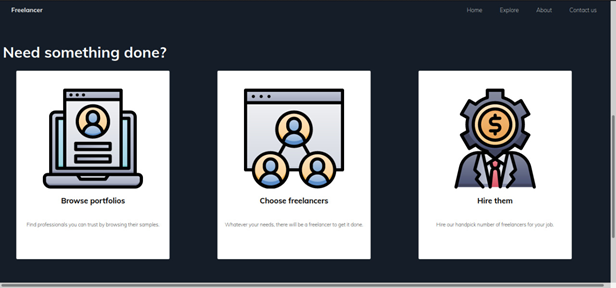
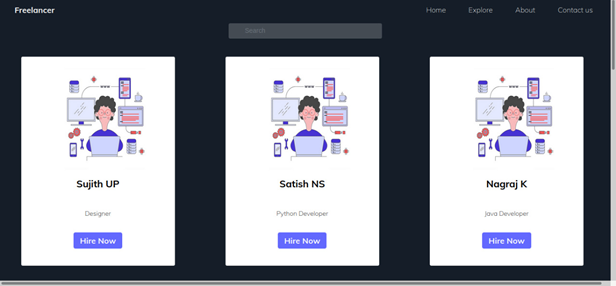
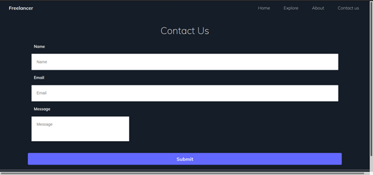
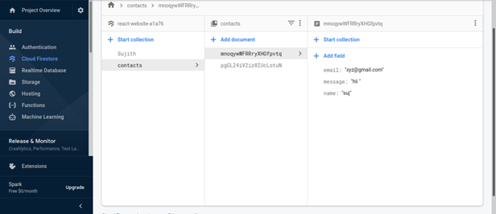

FULL STACK WEB DEVELOPMENT USING REACT.JS AND FIREBASE

The entitled project “FREELANCE SERVICES” is made keeping in mind all the aspects of 
the freelancers. This Project is an online market place for freelance services. Our Project has 
no geographic limitations to hire a freelancer and also provides quick and easy access for 
temporary tasks.

Firebase will be used as “Back-end” which will be capable of 
recording information and high-level language React JavaScript will 
serve as “Front-end”.

Features:

1. Schedule a reservation order.
2. Contact form.
3. Search based on the profession.
4. Explore page for customers.
5. About page.
6. Responsive design.

Screenshots:

- Homepage -

- Explore page -

- Contact form -

- Firebase(backend) -

